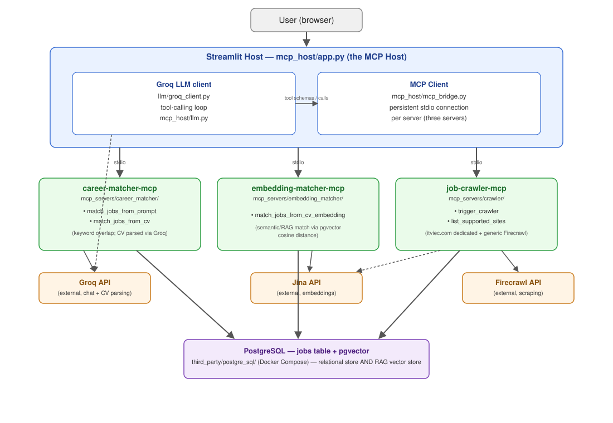
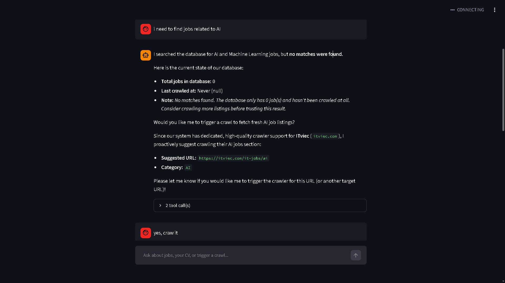
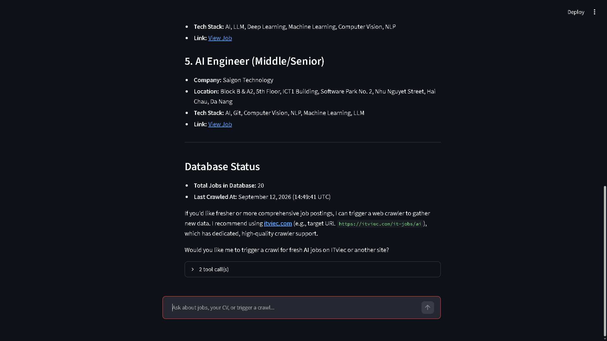
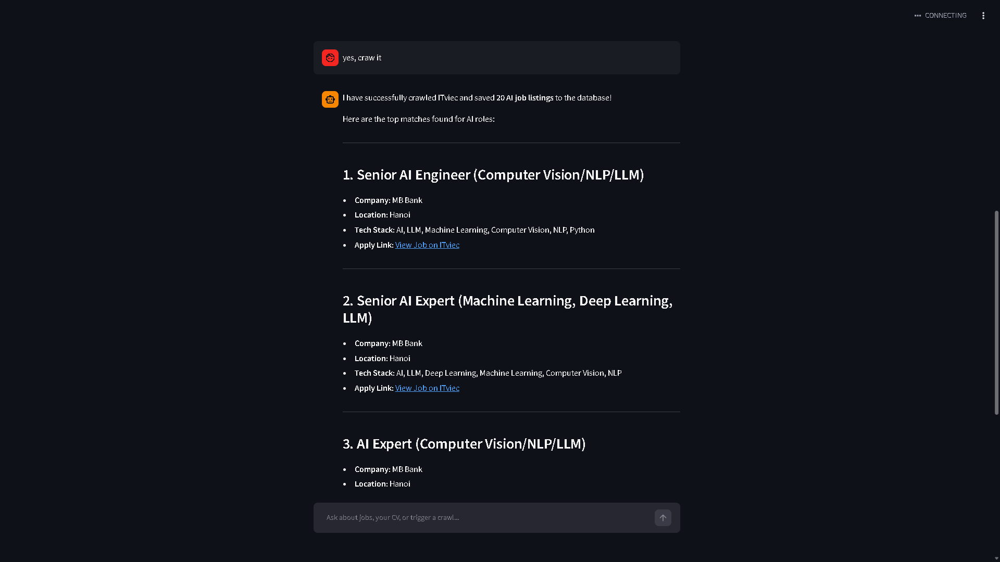
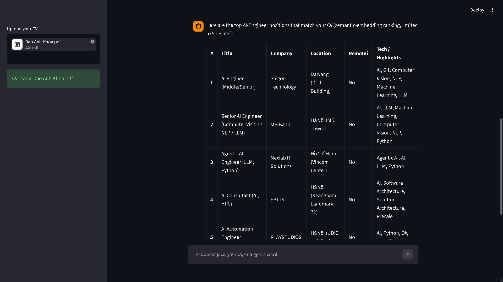

# Career Matcher Agentic

A practice project for building an end-to-end MCP system: multiple MCP
servers, a minimal manual MCP client, and a custom chat host (Streamlit +
Groq) instead of Claude Desktop/Code as the host.

Domain: a career-matching assistant that searches a local job database,
crawls job boards to populate it, and matches a candidate's skills — typed
or extracted from a CV — against real postings.

## Architecture



- **`mcp_host/`** — Streamlit app, the actual MCP host. Runs a Groq LLM plus
  an MCP client connected to all three servers, and drives the tool-calling
  loop.
- **Three MCP servers** — see below.
- **`mcp_clients/`** — minimal MCP client with no LLM, for calling one tool
  by hand.
- **`llm/`** — shared Groq client (chat loop + CV extraction).
- **`embedder/`** — shared Jina embedding client.
- **PostgreSQL** (`third_party/postgre_sql/`, with `pgvector`) — the shared
  `jobs` table, including embeddings.

## MCP servers

- **`career-matcher-mcp`** — `match_jobs_from_prompt`, `match_jobs_from_cv`:
  keyword/skill-overlap matching.
- **`embedding-matcher-mcp`** — `match_jobs_from_cv_embedding`: semantic
  matching via Jina embeddings.
- **`job-crawler-mcp`** — `trigger_crawler`, `list_supported_sites`: scrapes
  job boards into the database.

Each subpackage has its own README with implementation details.

## Screenshots

No jobs in DB yet, so the assistant offers to crawl a predefined site:



Database status after crawling finishes:



Jobs returned once crawling is done:



Keyword matching against a PDF CV (RAG fallback):


Embedding-based semantic matching against a PDF CV:



## Running it

```bash
docker compose up -d
uv run alembic upgrade head
uv run streamlit run career_matcher_agentic/mcp_host/app.py
```

Requires `GROQ_API_KEY` (`llm/.key`), `JINA_KEY` (`embedder/.key`), and
`FIRECRAWL_API_KEY` (`mcp_servers/crawler/.key`) — see the `.key.example`
files next to each.
